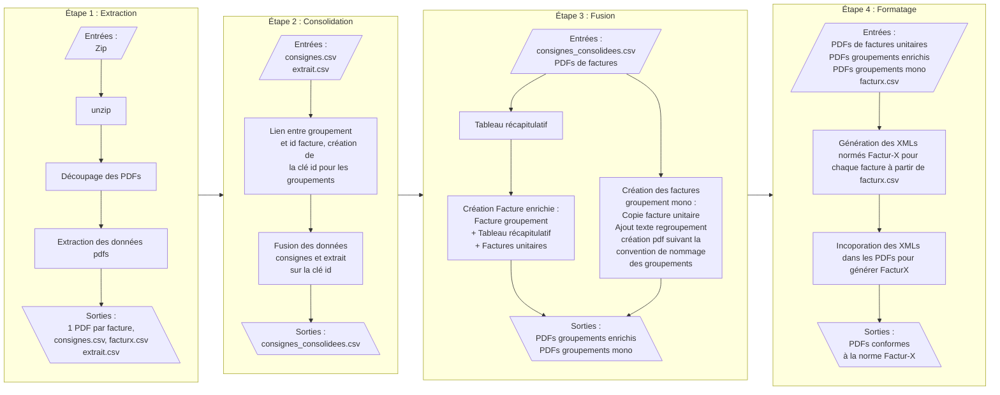

# Atelier Facture

## Instalation

```bash
pip install atelier_facture
```

## Usage

```bash
atelier_facture ~/chemin/atelier -i fichier.zip 
```

l'option `-v` ou `-vv` permet d'augmenter le niveau de verbosité des logs.

## Fonctionnement général



## Étape 1 : Extraction

L'étape d'extraction se concentre sur l'analyse et la transformation initiale des fichiers PDF contenus dans des archives (ZIP). Elle permet d'extraire les informations essentielles et de structurer les fichiers pour les étapes suivantes.

### Description des actions principales

#### Identification récursive des PDF dans le ZIP

- **Recherche de tous les fichiers PDF**, y compris dans des ZIP imbriqués.
- **Extraction des PDF trouvés** dans un dossier temporaire.

#### Analyse de chaque PDF

Pour chaque fichier PDF extrait, la fonction `extract_and_format_data` est utilisée pour analyser chaque page et rechercher un ensemble de motifs prédéfinis :

```python
patterns = {
    'id': r"N° de facture\s*:\s*(\d{14})",
    'date': r'VOTRE FACTURE\s*(?:DE\s*RESILIATION\s*)?DU\s*(\d{2})\/(\d{2})\/(\d{4})',
    'pdl': r'Référence PDL : (\d+)',
    'groupement': r'Regroupement de facturation\s*:\s*\((.*)\)',
    'membre': r'Nom et Prénom ou\s* Raison Sociale :\s*(.*?)(?=\n|$)'
}
```

Ces motifs permettent d'extraire :

- **id** : Numéro de facture (14 chiffres).
- **date** : Date de la facture.
- **pdl** : Référence PDL.
- **groupement** : Regroupement de facturation.
- **membre** : Nom ou raison sociale.

Les données recherchées sont présentes uniquement sur la première page de chaque facture. Cela permet d'identifier les plages de pages correspondant à chaque facture.

#### Découpage et création des PDF individuels

Pour chaque couple (données extraites, plage de pages), un nouveau PDF est généré en suivant les conventions définies dans `file_naming.py`.

Les opérations incluent :

- **Copie des pages de la plage** dans un nouveau PDF pour chaque facture identifiée.
- **Application de correctifs au texte du PDF** si nécessaire (ex. remplacement d'informations, amélioration de la lisibilité des regroupements).
- Les fichiers générés sont stockés dans le dossier **extrait**.
- Chaque fichier découpé et les données associées sont enregistrés dans une dataframe `extrait`.

#### Export des fichiers CSV

Deux fichiers CSV sont extraits du ZIP d'origine et écrits dans le dossier extrait :

- **consignes.csv** : Contient des informations spécifiques pour les étapes suivantes.
- **facturx.csv** : Données structurées pour l'intégration FacturX.
- La dataframe `extrait`, contenant toutes les informations acquises pendant la procédure d'extraction, est également exportée en CSV sous le nom **extrait.csv**.

### Organisation des fichiers générés

- Les nouveaux PDF découpés et corrigés sont stockés dans le dossier **extrait**.
- Les fichiers CSV produits :
  - **consignes.csv** : Contient les instructions nécessaires à la consolidation et fusion.
  - **facturx.csv** : Fournit les données nécessaires pour l'enrichissement FacturX.
  - **extrait.csv** : Liste les pdfs extraits, leurs données associées et leur emplacement.
  
### Points importants

- Cette étape utilise les motifs définis pour **identifier et découper les factures**.
- **Les corrections appliquées aux PDF** sont adaptées aux besoins spécifiques (remplacement d'informations, amélioration de la lisibilité).

Bien que les fonctions utilisées soient prévues pour, il n'y a pour l'instant pas de mécanique de personnalisation par l'utilisateur·ice. Un chargement dynamique par YAML peut être envisagé.

---

## Étape 2 : Consolidation

Le principe est simple : on utilise les deux fichiers **consignes.csv** et **extrait.csv** qui représentent respectivement ce qui est attendu et ce que l'on a effectivement réussi à extraire, pour préparer les étapes suivantes. Ces fichiers sont chargés dans des dataframes.

### Exemple de tableau de consignes

| id   | pdl           | groupement | membre   | Nom du site | Puissance (kVA) | Volume (kWh) |
|------|---------------|------------|----------|-------------|----------------|--------------|
|      |               | A          | Membre 1 | Site 1      | 10             | 1000         |
| ID02 | 10000000000001| A          | Membre 1 | Site 2      | 20             | 2000         |
| ID03 | 10000000000002| A          | Membre 1 | Site 3      | 30             | 3000         |
| ID04 | 10000000000003| A          | Membre 1 | Site 4      | 40             | 4000         |
|      |               | B          | Membre 2 | Site 5      | 50             | 5000         |
| ID06 | 10000000000005| B          | Membre 2 | Site 6      | 60             | 6000         |
| ID07 | 10000000000006| G          | Membre 2 | Site 7      | 70             | 7000         |
| ID08 | 10000000000007|            | Membre 3 | Site 8      | 80             | 8000         |
| ID09 | 10000000000008|            | Membre 4 | Site 9      | 90             | 9000         |
| ID10 | 10000000000009| J          | Membre 5 | Site 10     | 100            | 10000        |

### Détection du type d'opération

Pour chaque ligne de la table de consignes :

- **Si le PDL est vide**, alors c’est un groupement à enrichir.
- **Sinon**, si le groupement associé est unique (par exemple **G** ou **J**), c’est un groupement mono PDL.
- **Sinon**, c’est une facture unitaire.

### Lien entre groupement et ID facture

- Lien entre le groupement et l'ID de la facture de groupement associée.
- Création de la clé **id** pour les groupements dans la dataframe consignes.

### Fusion des données

Les données des fichiers **consignes** et **extrait** sont fusionnées sur la clé **id** (extraite dans consigne), ce qui permet de récupérer (entre autres) la colonne **fichier_extrait** qui contient le chemin du PDF de facture correspondant à chaque ligne de la table consignes.

### Vérifications

À partir de là, il est possible d'opérer diverses vérifications :

- **Vérifier qu'on a bien extrait toutes les factures attendues**.
- **Identifier si une facture inattendue a été extraite**.

### Dataframe consignes_consolidées

La dataframe `consignes_consolidées` contient toutes les informations nécessaires pour réaliser les étapes suivantes. Un export CSV est réalisé sous le nom **consignes_consolidées.csv**.

## Étape 3 : Fusion

L'étape de fusion se concentre sur la création des factures de groupement enrichies et des factures de groupement mono PDL.

### Création des factures de groupement enrichies (type == groupement)

Pour chaque groupement identifié dans la dataframe `consignes_consolidées` qui nécessite un enrichissement, une facture de groupement enrichie est générée. Cette facture regroupe toutes les factures individuelles associées au groupement, permettant ainsi une vue d'ensemble pour les membres du groupement.

Le code de la fonction `fusion_groupes` est utilisé pour réaliser cette fusion. Les étapes principales incluent :

- **Tri des données** par `membre`, `groupement`, `type` et `pdl` afin de garantir une organisation cohérente.
- **Création d'un tableau récapitulatif** contenant les informations de chaque PDL, exporté sous forme de PDF.
- **Concaténation des fichiers PDF** : Les différentes parties (facture de regroupement, tableau récapitulatif, factures individuelles) sont fusionnées pour créer un fichier PDF unique pour le groupement.

### Création des factures de groupement mono PDL (type == mono)

Pour les groupements mono PDL (identifiés par un groupement unique, par exemple **G** ou **J**), une facture de groupement spécifique est créée avec la convention de nommage des groupements définie dans `file_naming`.
Les factures de groupement mono PDL sont générées en appliquant des transformations spécifiques, telles que l'ajout de lignes de regroupement au document PDF. La fonction `apply_pdf_transformations` est utilisée pour appliquer ces modifications.

### Export des Factures Fusionnées

Les factures fusionnées sont exportées dans un dossier spécifique sous forme de fichiers PDF, prêtes à être utilisées pour les étapes suivantes du processus.
Après avoir créé ou enrichi les fichiers PDF de chaque groupement, la colonne `pdf` de la dataframe est mise à jour avec le chemin du fichier PDF créé. Pour les entrées où aucun fichier enrichi n'est défini, le chemin du fichier extrait est copié dans la colonne `pdf`.

---

## Étape 4 : Génération des Factures FacturX

L'étape 4 consiste à générer les factures au format FacturX, en utilisant les informations fusionnées des étapes précédentes et en les enrichissant avec des données spécifiques provenant d'un fichier CSV.

### Fusion avec les données BT

La fonction `vers_facturx` est utilisée pour cette étape. Elle permet de fusionner les données de la dataframe `consignes_consolidées` avec un fichier CSV contenant des informations supplémentaires (par exemple, des informations spécifiques aux factures BT).

#### Étapes principales de la fonction `vers_facturx`

- **Chargement du CSV** : Le fichier CSV `facturx.csv` est chargé dans une dataframe `bt_df`.
- **Fusion des données** : La dataframe `bt_df` est fusionnée avec la dataframe `consignes_consolidées` en utilisant les colonnes `BT-1` (dans le CSV) et `id` (dans la dataframe `consignes_consolidées`) comme clés.
- **Suppression de la colonne `id`** : Après la fusion, la colonne `id` est supprimée car elle n'est plus nécessaire.
- **Traitement des factures** : La fonction `process_invoices` (provenant de la librairie [Facturix](https://github.com/Virgile-Dauge/facturix)) est ensuite utilisée pour générer les factures au format Factur-X. Elle génére le XML de chaque facture à partir de la ligne correspondante de la dataframe `bt_df` consolidée. Puis incorpore ce xml dans le PDF de facture.

### Export des erreurs

Les erreurs éventuelles rencontrées lors du traitement des factures sont retournées par la fonction `vers_facturx` et peuvent être utilisées pour corriger les anomalies avant de procéder aux étapes finales du processus.

## Structure du projet (BESOIN de MAJ)

- `atelier_facture.py` : Script principal pour le traitement des factures
- `file_naming.py` : Fonctions pour la gestion des conventions de nommage
- `rich_components.py` : Composants rich.py pour une visualisation de l'avancement des taches qui peuvent prendre beaucoup de temps
- `extraction.py` : Fonctions pour l'extraction des PDFs et des données
- `pdf_utils.py` : Utilitaires pour la manipulation des PDFs, remplacement de textes, compression
- `fusion.py` : Fonctions pour la création des pdfs de groupement enrichits d'un tableau récapitulatif et des factures unitaires
- `mpl.py` : Fonction matplotlib pour la création des tableaux récapitulatifs
