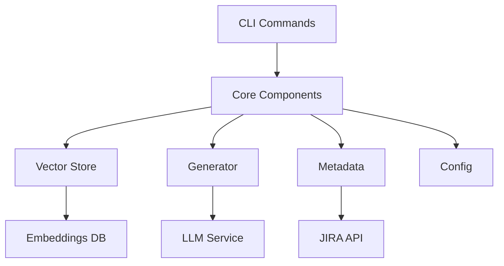

# API Documentation

Welcome to JiraGen's API documentation. This section provides detailed information about JiraGen's components and how to use them programmatically.

## Architecture Overview



## Component Overview

!!! info "Core Components"
    - **Vector Store**: Manages code embeddings for semantic search
    - **Generator**: Handles AI-powered ticket generation
    - **Metadata**: Manages JIRA issue metadata and validation
    - **Config**: Handles application configuration

!!! info "CLI Components"
    - **Generate**: Creates JIRA tickets with AI assistance
    - **Add**: Indexes codebase into vector store
    - **Init**: Sets up configuration and directories
    - **Upload**: Handles JIRA issue creation

## Quick Links

- [Core API Reference](core.md): Core components documentation
- [CLI API Reference](cli.md): CLI components documentation
- [Getting Started Guide](../getting-started.md): Installation and basic usage

## Example Usage

Here's a simple example of using JiraGen's API to generate and upload a ticket:

```python
from jiragen.core.client import VectorStoreClient
from jiragen.cli.generate import generate_issue
from jiragen.cli.upload import upload_command

# Initialize vector store
store = VectorStoreClient()

# Generate ticket content
result = generate_issue(
    store=store, message="Add dark mode support", model="openai/gpt-4o", upload=True
)

if result:
    print("✨ Ticket generated and uploaded successfully!")
```

## API Stability

!!! note "Versioning"
    JiraGen follows semantic versioning. The API is considered stable for all releases with version >= 1.0.0.

!!! warning "Beta Features"
    Features marked as beta may change in minor releases. They are marked with a `(beta)` tag in the documentation.

## Need Help?

- Check out our [Contributing Guide](../contributing.md)
- Open an issue on [GitHub](https://github.com/Abdellah-Laassairi/jiragen/issues)
- Join our community discussions
