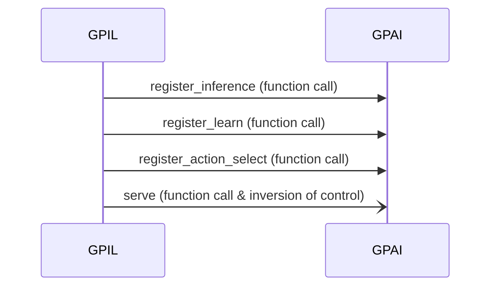
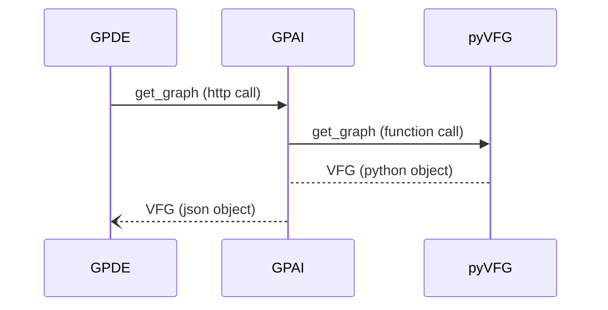
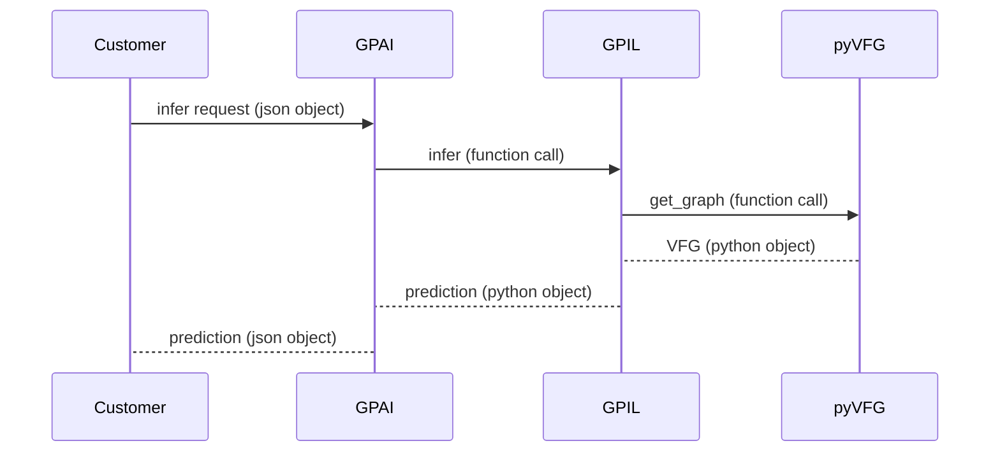

# Single-Process Migration Strategy

* status: proposed
* deciders: [Lori Pike](mailto:lori.pike@verses.ai), [Richard Petty](mailto:richard.petty@verses.ai), [Sylvain Pronovost](mailto:sylvain.pronovost@verses.ai), [Lior Saar](mailto:lior.saar@verses.ai)
* date: 2024-10-14

## Summary
The overall idea is to have a single library which someone working on Active Inference can load, which exposes all of the power of the genius platform, without the need for orchestration or the need to have the python code understand it is communicating with a remote service.

### Goals
- The goal from the GPIL side is for them to call a library which completely obscures everything we're doing with regard to messages to and from users.
- The goal from the GPAI side is to remove the message bus and have fewer components.
- The goal from the GPDE side is **no changes**.

### Motivation
Most "components" (in the sense of separate Docker containers) would be removed, as separate concerns. The existing rust code would be integrated into a single Rust library, to preserve as much of the work as is still relevant. This rust library would then be exposed via pyo3 and a mixture of generated and manual binding generation, to expose a reasonable and expected Python library.

The python library "drives" the Rust library, and is the primary interface for all components. This library will also expose HTTP servers for what are currently called "integration components", so that clients can call them. The primary inspiration will be Lior's work on the `GPIL` python library, which has the right "format" of abstraction. With slightly more encapsulation of internals, we can completely hide the message bus from the user: At that point, we can swap out the message bus for direct calls. Since we have not yet shipped, we can do this as without change management, as one PR change.

### Implementation Plan
Deployment artifacts are marked with (†).

1. ensure that the GPFGS and GPAI external integration components are available with python bindings (†)
2. build a GPIL library that, in its `GPIL` class, has obscured callbacks instead of exposing the message bus directly
3. convert the GPIL class to use the library exposed in (1)
4. ensure the new artifact is compliant with testing plan
5. expose GPIL's library as its own python artifact (†)

## Architecture Diagram
Below is an architecture diagram for the proposed system, consisting of deliverables and their expected communications.

In this diagram, "Customers" are users using the API surface directly, and GPDE represents customers interfacing through
our bespoke model editor software. "Verses General Purpose Agent" encompasses this entire effort.

The "GPAI Library (python)" currently lives in the [gpil-pipeline repo](https://github.com/VersesTech/gpil-pipeline), and
is responsible for the HTTP input processing, and putting the bits of the model together.

The "model boundary" represents a theoretical boundary around which "model swappablity" can occur -- things inside this boundary will be
swapped, things outside will not be. pyvfg falls within this boundary, because it is still possible for the user to
accept vfg input and send vfg output without direct connection to pyvfg. We will continue to provide this library
for independent linking for users that wish to swap the model implementation, but not write a parser for our types.
`pyvfg`, as the name implies, is a python interface around the rust code that lives in
[the genius_agent_factor_graph repo](https://github.com/VersesTech/genius_agent_factor_graph).

"Mounted filesystem" is mounted in Docker via Docker processes; in k8s deployments and wider scope deployments, it
will likely not actually be a literal filesystem, but it will be file-addressable, so it meets the needs of `pyvfg`.

## Deliverables
- pyVFG (python library)
  - Library that provides persistence and selective retrieval for graph storage
    - A python interface to the existing repo, `genius_agent_factor_graph`
  - Exposes VFGv1 as Python types
  - Exposes `get_graph`, `replace_graph`, and `get_subgraph_from` as Python functions
    - `get_graph` accepts python-typed VFGv1
    - `replace_graph` and `get_subgraph_from` return python-typed VFGv1
  - DOES NOT use protobuf.
  - DOES NOT use a message bus.
- GPAI (python library / framework)
  - Library that provides the core of Genius Agent Platform to Inference/Learning code written in Python
    - Refactoring of the `GPAI` class from the `gpil` repo
  - Provides two interfaces:
    - Python:
      - Exposes python types of objects for observation and action potential (these should be re-exported from pyVFG)
      - callbacks for `register_action_select`, `register_learn`, and `register_infer`
        - preserves capability of swapping the GPIL program later
      - exposes `get_graph`, `replace_graph`, and `get_subgraph_from`
        - These are re-exports from pyVFG
        - This opinionation is important to ensure `get_graph` and `replace_graph`, as needed for GPDE's work, continue to work as they expect
    - HTTP:
      - Exposed on server start
      - Full documentation will be via OpenAPI. Sketch of endpoints available in [API Endpoints](#api-endpoints) in this document.
  - DEFER protobuf support -- JSON only expected.
  - DOES NOT use a message bus.
- GPIL (python program)
  - Library that provides Verses-implemented active learning using a variety of models and frameworks
  - `pmgpy`, `pymdp`, etc are currently supported
  - Main executable of the docker container
  - This is the main swappable component. Actual swapping should be DEFERRED until after Curie. The verses-supplied component encompasses sufficient functionality to run inference, learning, and action selection for discrete state spaces in active inference.
- DEFER: Developer Documentation for GPAI (Documentation)
  - This should be DEFERRED until after Curie.
  - Will encompass how to use the callbacks, requirements for doing so, expected behavior of such callbacks. May involve tutorials and sample code.
- OpenAPI Documentation of GPAI (Documentation)
  - OpenAPI specification for [endpoints](#api-endpoints)
  - Necessary for GPDE and for customers to call into endpoints
- Verses General-Purpose Agent (Docker Container)
  - A self-hostable Docker container that responds to the below API endpoints with suitable results
  - The main executable is the GPIL program, which will **directly** depend on GPAI.
    - GPAI will, in turn, directly depend on pyVFG
  - This provides an `infer` function, a `learn`, function, and an `action_select` function.
  - It registers its callbacks with GPAI.
  - DOES NOT have **any** knowledge of networking
  - DOES NOT have intrinsic observability, storage, or reloading
  - DOES process VFG types
- DEFER: Docker runtime documentation for the container (Documentation)
  - Instructions for configuring, setting up, and running the docker container
  - DEFER due to us hosting the first version

### API Endpoints
| Endpoint        | Method | Return Type    | Expected User                      |
|-----------------|--------|----------------|------------------------------------|
| `get_graph`     | GET    | VFG (JSON[^1]) | GPDE                               |
| `set_graph`     | POST   | VFG (JSON[^1]) | GPDE                               |
| `learn`         | POST   | JSON[^1]       | Customer-created automated process |
| `infer`         | POST   | JSON[^1]       | Customer-created automated process |
| `action_select` | POST   | JSON[^1]       | Customer-created automated process |
[^1]: A technical measure, known as "content negotiation", allows clients to later ask for protobuf (or other protocols) if we wish to support them later.

### Call Sequence
#### Maximal initialization

#### Incoming `get_graph` request

#### Incoming `learn` request

## Non-outcomes
- Preservation of all existing work (some work *will* no longer be required)
- Measurable performance increase in any component other than GPIL
- Simplification of deployment concerns from any individual unit

## Test Plan
1. Unit tests in GPIL should be changed to not use the message bus, and communicate only through the `GPAI` interface
2. Integration tests should be first, run with a message bus, then, run *without* a message bus
3. The `GPIL` library should be tested with the `GPIL` integration tests
4. Then, finally, we run it all as a single process, and verify with GPIL integration tests *and* the GPFGS integration tests that the process still works as both GPFGS and GPIL

## Links
- [ADR](../architecture/2024-10-11%20New%20Format%20for%20Message%20Bus.md)
- [Component visual representation](https://miro.com/app/board/uXjVLTpLzmY=/?share_link_id=858905395448)
